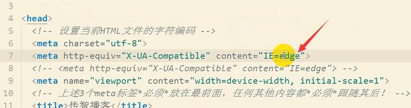
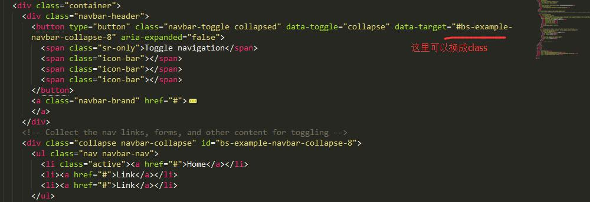

# 【❤】bootstrap learning summary~c~

### 1.基础：

* [官方API](http://v3.bootcss.com/css/)先扣一遍;

### 2入口模板：

```html
<!DOCTYPE html>
<html lang="zh-CN">
  <head>
    <meta charset="utf-8">
    <meta http-equiv="X-UA-Compatible" content="IE=edge">
    <meta name="viewport" content="width=device-width, initial-scale=1">
    <!-- 上述3个meta标签*必须*放在最前面，任何其他内容都*必须*跟随其后！ -->
    <title>Bootstrap 101 Template</title>

    <!-- Bootstrap -->
    <link href="css/bootstrap.min.css" rel="stylesheet">

    <!-- HTML5 shim and Respond.js for IE8 support of HTML5 elements and media queries -->
    <!-- WARNING: Respond.js doesn't work if you view the page via file:// -->
    <!--[if lt IE 9]>
      <script src="https://cdn.bootcss.com/html5shiv/3.7.3/html5shiv.min.js"></script>
      <script src="https://cdn.bootcss.com/respond.js/1.4.2/respond.min.js"></script>
    <![endif]-->
  </head>
  <body>
    <h1>你好，世界！</h1>

    <!-- jQuery (necessary for Bootstrap's JavaScript plugins) -->
    <script src="https://cdn.bootcss.com/jquery/1.12.4/jquery.min.js"></script>
    <!-- Include all compiled plugins (below), or include individual files as needed -->
    <script src="js/bootstrap.min.js"></script>
  </body>
</html>
```

* meta设置选用最新IE浏览器，设置适配浏览器的屏幕宽度，初始缩放比：



* IE浏览器的各种版本测试模式：


* 条件注释：


### 3.视口：

* 说明：


* 标签：好像所有的dom都是100%内置的，需要用栅格系统进行划分列
```
  <header id="header">
    <div class="topbar visible-md visible-lg">
      <div class="container">
        <div class="row">
          <div class="col-md-2 text-center">
            <a href="#" class="mobile-link">
              <i class="icon-mobilephone"></i>
              <span>手机微金所</span>
              <i class="glyphicon glyphicon-chevron-down"></i>
              
            </a>
          </div>
        </div>
      </div>
    </div>
    <nav class="navbar navbar-itcast navbar-static-top">

    </nav>
  </header>
```

* 视口设置为设备的宽度。里面的页面设置为宽度为100%（body的宽度），然后响应设备的宽度进行变化，col-md-n 这个分列有相对定位。body就是那个容器，页面内设置宽度为100%，页面相应设备的宽度设置body的宽度。


* 布局容器：版心的设置：分布的栅格系统没有设置有几列的话就自动百分百


* 栅格参数：


* 媒体查询：条件是最小宽度的话，写的规则是从小到大的抒写


### 4.bootstrap文件：

* css高亮主题文件：


* 可用的类：


* 可作为按钮使用的标签


### 5.样式设置：

#### 5.1公共样式与选择器：

* body：设置字体样式

```
body {
  font-family: "Helvetica Neue", Helvetica, Microsoft Yahei, Hiragino Sans GB, WenQuanYi Micro Hei, sans-serif;
}
```

* margin ：0 auto;居中
* 排序选择器：


* 兄弟选择器：


* box-size:border-box。盒子的宽度就是向内压缩的。border，padding，width。三个值加起来就是总宽。

#### 5.2 字体设置：

* 字体设置：设置字的内容还是内容设置：

```
@font-face {
  font-family: 'itcast';
  src: url('../font/MiFie-Web-Font.eot') format('embedded-opentype'), 
  url('../font/MiFie-Web-Font.svg') format('svg'), 
  url('../font/MiFie-Web-Font.ttf') format('truetype'), 
  url('../font/MiFie-Web-Font.woff') format('woff');
}

<!-- 通配选择器  前面是以"icon-"开头 然后包含" icon-"的类名 -->
[class^="icon-"],
[class*=" icon-"] {
  font-family: itcast;
  font-style: normal;
}
```


* 档字体文件：


#### 5.3 栅格系统：

* 设置好栅格系统，设置高度先撑起来：


* a标签里面放入其他的标签：


* 左边固定宽度，右边自适应屏幕
  - 左边设置浮动或者定位，设置固定宽度，下面的元素会上来。
  - 下面设置margin-left = 固定宽度，就形成自适应了。


* 列偏移：
  - col-md-offset-2 列偏移还是在12格内
  - sublime 快速定位代码位置 Ctrl+R

#### 5.4 伪类设置：

* ::before，::after 伪类设置前后的两个公用的地方

```css
.panel-czbk > .panel-heading::before,
.panel-czbk > .panel-heading::after {
  content: ' ';
  width: 16px;
  height: 16px;
  border-radius: 8px;
  background-color: #f0f0f0;
  position: absolute;
}

.panel-czbk > .panel-heading::before {
  top: -8px;
  left: -8px;
}

.panel-czbk > .panel-heading::after {
  bottom: -8px;
  left: -8px;
  box-shadow: 0 2px 1px #ccc inset;/*内嵌样式*/
}
```

#### 5.5 空白字符：

* 一个dom100%宽。子dom之间有个换行，就是空白字符，会占有像素，所以两个子dom百分比分父亲的100%，就分不来，所以第二个dom就会换行。

```html
  <div class="container">
    <div class="left"></div>
    <div class="right"></div>
  </div>
```

* css设置字体大小为0就可以了：

```css
.container {
      width: 1024px;
      height: 2000px;
      margin: 0 auto;
      font-size: 0;
    }
```


#### 5.6 菜单栏横向滚动：

```js
  var $ulContainer = $('.nav-tabs');
  // 获取所有子元素的宽度和
  var width = 30; // 因为原本ul上有padding-left
  // 遍历子元素
  $ulContainer.children().each(function(index, element) {
    width += element.clientWidth;
  });
  // 此时width等于所有LI的宽度总和
  // 判断当前UL的宽度是否超出屏幕，如果超出就显示横向滚动条
  if (width > $(window).width()) {

    $ulContainer
      .css('width', width)
      .parent().css('overflow-x', 'scroll');
      // 这个样式竟然可以横向滚动。我去。
  }
```


#### 5.7 em & rem：

* 一个em,代码当前标签font-size的大小。
* rem （root-em）取HTML的font-size
* bootstrap 4.0全面使用rem

#### 5.8 左浮右浮动：


### 6.自定义按钮样式：BBG

* 自己生产自己的按钮样式


* 或者找源码中的代码进行复制后自己修改：


* 修改默认样式，导航条首先要知道哪个是控制样式的最大的style复制。比如navbar-inverse。接着把我们的navbar-inverse改成我们需要的比如navbar-cc-nav。接着在浏览器直接改样式，在浏览器点击改完的文件，全选，复制到我们本地样式文件。无论改哪个样式，肯定改的是本地样式


### 7.轮播图：

#### 7.1 控制目标：

```html
<!-- 
  以下容器就是整个轮播图组件的整体，
  注意该盒子必须加上 class="carousel slide" data-ride="carousel" 表示当前是一个轮播图
  bootstrap.js会自动为当前元素添加图片轮播的特效
-->
<div id="轮播图的ID" class="carousel slide" data-ride="carousel">
  <!-- ol标签是图片轮播的控制点 -->
  <ol class="carousel-indicators">
    <!-- 
      每一个li就是一个单独的控制点
        data-target属性就是指定当前控制点控制的是哪一个轮播图，其目的是如果界面上有多个轮播图，便于区分到底控制哪一个
        data-slide-to属性是指当前的li元素绑定的是第几个轮播项
      注意，默认必须给其中某个li加上active，展示的时候就是焦点项目
    -->
    <li data-target="#轮播图的ID" data-slide-to="0" class="active"></li>
    <li data-target="#轮播图的ID" data-slide-to="1"></li>
    <!-- ...更多的 -->
  </ol>
  <!-- 
    .carousel-inner是所有轮播项的容器盒子，
    注意role="listbox"代表当前div是一个列表盒子，作用就是给当前div添加一个语义
  -->
  <div class="carousel-inner" role="listbox">
    <!-- 每一个.item就是单个轮播项目，注意默认要给第一个轮播项目加上active，表示为焦点 -->
    <div class="item active">
      <!-- 轮播项目中展示的图片 -->
      
      <div class="carousel-caption">
        <!-- 标题或说明性文字，如果不需要，直接删除当前div.carousel-caption -->
      </div>
    </div>
    <div class="item">
      <!-- ... -->
    </div>
    <!-- ... -->
  </div>
  <!-- 图片轮播上左右两个控制按钮，分别点击可以滚动到上一张和下一张 -->
  <!-- 此处需要注意的是 该a链接的href属性必须指向需要控制的轮播图ID -->
  <!-- 另外a链接中的data-slide="prev"代表点击该链接会滚到上一张，如果设置为next的话则相反 -->
  <a class="left carousel-control" href="#轮播图的ID" role="button" data-slide="prev">
    <span class="glyphicon glyphicon-chevron-left" aria-hidden="true"></span>
    <span class="sr-only">上一张</span>
  </a>
  <a class="right carousel-control" href="#轮播图的ID" role="button" data-slide="next">
    <span class="glyphicon glyphicon-chevron-right" aria-hidden="true"></span>
    <span class="sr-only">下一张</span>
  </a>
 </div>
```

* 注意可以控制轮播图的点的target设置:


* 替换自己的target



* 在一个较小屏幕的展示一个超级宽的一个图片，想让图片居中显示，可以使用背景图：
  - 1--div的背景图--先设置盒子的高度，在设置背景的居中情况，显示大小覆盖情况
  - 2--定位 p;a left:50%;margin-left:-width/2;


#### 7.2 图片响应：

* 各个端需要正常显示图片
* 移动端使用小图（体积）
* 实现
  - 先把两个图片的地址绑定到dom的属性上。
  - JS 拿到屏幕的大小，判断是否是小屏幕，获取相应的标签，然后做相应的渲染
  - css:最小大于768px,设置高度为设置的值。当满足为小屏幕时，设置为图片，图片的话就是宽度100%；高度也会跟着相应变化了。


```
#main_ad > .carousel-inner > .item {
  background-repeat: no-repeat;
  background-position: center center;
  background-size: cover;
}
<!-- 屏幕最小宽度大于768，就设置410高度 -->
@media (min-width: 768px) {
  #main_ad > .carousel-inner > .item {
    height: 410px;
  }
}
<!-- 设置好图片的样式。width100%，高度auto -->
#main_ad > .carousel-inner > .item > img {
  width: 100%;
}
```

```
$(window).on('resize', resize).trigger('resize');
事件委派执行。
```


#### 7.3 轮播图手机端的左右滑动

```js
  // 获取界面上的轮播图容器
  var $carousels = $('.carousel');
  var startX, endX;
  var offset = 50;
  // 注册滑动事件
  $carousels.on('touchstart', function(e) {
    // 手指触摸开始时记录一下手指所在的坐标X
    startX = e.originalEvent.touches[0].clientX;
    // console.log(startX);
  });

  $carousels.on('touchmove', function(e) {
    // 变量重复赋值
    endX = e.originalEvent.touches[0].clientX;
    // console.log(endX);
  });
  $carousels.on('touchend', function(e) {
    console.log(e);
    // 结束触摸一瞬间记录最后的手指所在坐标X
    // 比大小
    // console.log(endX);
    // 控制精度
    // 获取每次运动的距离，当距离大于一定值时认为是有方向变化
    var distance = Math.abs(startX - endX);
    if (distance > offset) {
      // 有方向变化
      // console.log(startX > endX ? '←' : '→');
      // 2. 根据获得到的方向选择上一张或者下一张
      //     - $('a').click();
      //     - 原生的carousel方法实现 http://v3.bootcss.com/javascript/#carousel-methods
      $(this).carousel(startX > endX ? 'next' : 'prev');
    }
  });
```

#### 7.4 JS组件与CSS组件的区别

* 就是有的dom上放置了一些属性，JS判断这些属性的是否有，然后决定他们的JS相应。这么说决定他业务的一般是一个属性值。
* 所以皮肤就是css,业务才是JS，两者没有关系。


### 8.吸顶设置：affix

* data-spy="affix" data-offset-top="40" 往下拉超过多少开始吸顶
* data-offset-bottom="200"  

### 9.模态框

* 特别注意：把需要的东西放在modal-body里面


### 10.table栏

* 目标控制：


* 渐入渐出：


### 11.预处理得的less

* 和JS一样有去全局变量。全局函数（MixIn）
* 有嵌套的语法
* 使用：
  - //这个注释会转换完成后会被删除
  - 定义变量：@mianColor:#e45445;   不用写引号

```css
@mianColor:#e45445;
.container {
  width: 1000px;
  background-color: #ff0;
  .row {
    height: @width;
    div {
      border-left: 1px solid @mainColor;
      > a {  //直接子代这样加
        color: red;
        &:hover { //注意这里伪类这样加
          color: green;
        }
      }
    }
  }
}
```

* MixIn--定义个代码段

```
// 定义一个代码段，（）里的内容是参数，参数中:后的内容是参数的默认值（没有传参数）
.roundedCorners(@radius: 5px) {
  -moz-border-radius: @radius;
  -webkit-border-radius: @radius;
  border-radius: @radius;
}
/* 定义的类应用到另个一个类中 */
#header {
  .roundedCorners();
}
#footer {
  .roundedCorners(10px);
}
```

* 导入文件.less

```
@h: 100px;
@import url('_p.less');

//_p.less
p {
  line-height: @h;
}
```

* 内置函数
  - lighten：将一个颜色变亮
    + lighten(#000, 10%); // #1a1a1a
  - darken：将一个颜色变暗
    + darken(#000, 10%); // #e6e6e6


* sunlime less高亮插件 less2css

### 11.谷歌的微调工具

* 添加到工作空间：


* 链接到映射：


* 微调开始：


* 在文件里设置好：


* 退出工作空间：


### 12.自定义bootstrap

* 修改栅格系统：


* 定制：


